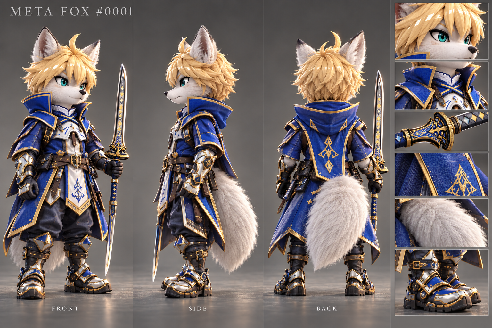

# Meta Foxes · 3D 角色视觉素材

按角色编号整理 Meta Foxes 的三视图、抬头看镜头分组图与大合照，提供图片预览、编号索引和文件校验记录，方便查找角色、浏览造型与查阅建模参考。

[项目官网](https://metafox.nextdao.xyz/zh) · [大合照](group-photo/MetaFox_217_Overhead.png) · [按组浏览](look-up/README.md#按组浏览) · [角色编号索引](look-up/characters.csv) · [下载全部素材](https://github.com/Next-DAO/meta-foxes-3d-models/archive/refs/heads/main.zip)

## 关于 Meta Foxes

[Meta Foxes](https://metafox.nextdao.xyz/zh) 是由 **NextDAO 社区发起的 NFT 项目**。根据官网介绍，原始 NFT 作品由艺术家为持有人手工定制，以不同的造型呈现每只狐狸的故事与个性。

本仓库收录这些角色的 **3D 风格视觉参考图**。当前文件均为 PNG 图片，可用于查看角色外观、多角度造型及分组姿态；可编辑的三维模型、网格、骨骼、动画及 `.blend`、`.glb`、`.fbx` 等工程文件尚未收录。

官网对原始 NFT 的创作介绍与本仓库素材的范围分别以官网说明和下方文件清单为准。官网当前标注「申请已永久关闭」（2026-10-04 核对）。

## 素材预览

| 角色 001 · 三视图 | 第 01 组 · 抬头看镜头 |
| --- | --- |
| [](001/001.png) | [](look-up/groups/group-01_001_002_003_004_005.png) |

点击预览图可打开原图。

### 大合照

`MetaFox_217_Overhead.png` 为角色大合照，原图尺寸 **8100 × 5400**，文件约 **58.3 MB**，保留上传时的原始 PNG 内容与文件名。

[查看文件](group-photo/MetaFox_217_Overhead.png) · [打开或下载高清原图](https://raw.githubusercontent.com/Next-DAO/meta-foxes-3d-models/main/group-photo/MetaFox_217_Overhead.png)

## 当前收录

| 素材 | 文件数量 | 覆盖角色 | 规格 | 位置 |
| --- | --- | --- | --- | --- |
| 角色三视图 | 217 张 | 217 个编号 | PNG，1536 × 1024 | 各编号目录，如 [001/001.png](001/001.png) |
| 抬头看镜头分组图 | 44 张 | 同一批 217 个编号 | PNG，1536 × 1024 | [look-up/groups/](look-up/groups/) |
| 角色大合照 | 1 张 | 217 角色集合图 | PNG，8100 × 5400 | [group-photo/MetaFox_217_Overhead.png](group-photo/MetaFox_217_Overhead.png) |

共 **262 张 PNG**，图片文件合计约 **693 MB**（不含 Git 历史）。这里的角色数量指本仓库已收录的素材数量。

三视图用于查看同一角色的不同角度与造型细节。分组图采用上方俯拍、角色抬头看镜头的构图：前 43 组每组 5 个角色，最后一组包含 `221`、`222` 两个角色。

## 目录与命名规则

```text
meta-foxes-3d-models/
├── README.md
├── 001/
│   └── 001.png                         # 角色 001 的三视图
├── 002/
│   └── 002.png
├── …
├── 222/
│   └── 222.png
├── group-photo/
│   ├── MetaFox_217_Overhead.png         # 高清大合照
│   └── manifest.json                  # 大合照尺寸、字节数与校验值
└── look-up/
    ├── README.md                       # 分组图说明与浏览目录
    ├── groups.csv                      # 44 组图片索引
    ├── characters.csv                  # 217 个角色的编号与位置索引
    ├── manifest.json                   # 来源文件名、规格与校验值
    └── groups/
        ├── group-01_001_002_003_004_005.png
        ├── group-02_006_007_008_009_010.png
        ├── …
        └── group-44_221_222.png
```

### 角色编号

- 文件夹和三视图文件名均使用三位编号，例如 `001/001.png`、`112/112.png`。
- 当前编号范围为 `001`–`222`，其中 `018`、`021`、`111`、`158`、`165` 缺少源素材，因此没有对应文件。
- 编号沿用源素材，缺号处不补图，也不将后续角色重新编号。

### 分组图片

命名格式为 `group-两位组号_三位角色编号列表.png`。例如：

```text
group-04_016_017_019_020_022.png
```

表示第 04 组包含 `016`、`017`、`019`、`020`、`022` 五个角色。文件名列出实际编号，保留缺号信息。

图内编号顺序依据源索引为：**左上 → 中上 → 右上 → 左下 → 中下**。最后一组的两个角色位于左上、中上。

## 查找与下载

### 已知角色编号

1. 查看三视图：打开对应编号目录，例如角色 `019` 的 [019/019.png](019/019.png)。
2. 查找分组图：在 [characters.csv](look-up/characters.csv) 中搜索 `019`，可查到组号、图内位置、分组图路径及三视图路径。
3. 对照原图：角色 `019` 位于 [第 04 组](look-up/groups/group-04_016_017_019_020_022.png) 的右上位置。

### 按组浏览

打开 [分组浏览目录](look-up/README.md#按组浏览)：点击组号查看分组图，点击角色编号查看对应三视图。也可以使用 [groups.csv](look-up/groups.csv) 查阅每组的编号、尺寸和原文件名。

### 下载素材

- **单张图片**：进入图片文件页面，通过 GitHub 的原始文件下载入口保存 PNG。
- **全部素材**：点击 [下载 ZIP](https://github.com/Next-DAO/meta-foxes-3d-models/archive/refs/heads/main.zip)，或在仓库首页选择 `Code → Download ZIP`。
- **使用 Git**：运行以下命令，仅获取当前版本，减少历史记录下载量。

```bash
git clone --depth 1 https://github.com/Next-DAO/meta-foxes-3d-models.git
```

## 索引与文件校验

| 文件 | 内容 |
| --- | --- |
| [look-up/groups.csv](look-up/groups.csv) | 组号、角色数量、角色编号顺序、图片尺寸、当前路径与原文件名 |
| [look-up/characters.csv](look-up/characters.csv) | 每个角色的组号、图内位置、分组图路径、三视图路径与原文件名 |
| [look-up/manifest.json](look-up/manifest.json) | 44 张分组图的完整映射、字节数、SHA-256 与 Git Blob SHA-1 |
| [group-photo/manifest.json](group-photo/manifest.json) | 大合照的文件名、尺寸、字节数、SHA-256 与 Git Blob SHA-1 |

`look-up/` 下的 CSV 与 JSON 内的文件路径均相对于 **`look-up/` 目录**。例如，`groups/group-01_001_002_003_004_005.png` 指向分组图，`../001/001.png` 指向仓库根目录下的三视图。

图片入库时按源文件原样复制，整理过程只调整目录与文件名。分组图的原文件名保留在索引和清单中，便于追溯。`look-up/manifest.json` 的校验范围为 44 张分组图。

后续补充素材时，请沿用已有角色编号和命名规则；分组图有变化时，同步更新两个 CSV 索引、JSON 清单及分组浏览目录。

## 项目链接与许可信息

以下项目入口来自 [Meta Foxes 官网](https://metafox.nextdao.xyz/zh)，核对日期为 **2026-10-04**。

| 入口 | 链接 |
| --- | --- |
| Meta Foxes 官网 | [metafox.nextdao.xyz/zh](https://metafox.nextdao.xyz/zh) |
| NextDAO | [nextdao.xyz](https://nextdao.xyz/) |
| NextDAO GitHub | [github.com/Next-DAO](https://github.com/Next-DAO) |
| OpenSea 系列 | [Meta Foxes Genesis](https://opensea.io/collection/meta-foxes-genesis) |
| 官网列出的合约 | [0xc599f72644140fe4d00ef9574100f636a30d923d](https://etherscan.io/token/0xc599f72644140fe4d00ef9574100f636a30d923d) |

当前仓库尚未提供独立的 `LICENSE` 文件。官网页脚标注 NextDAO 保留所有权利；素材的具体使用授权以项目方明确发布的许可说明为准。
